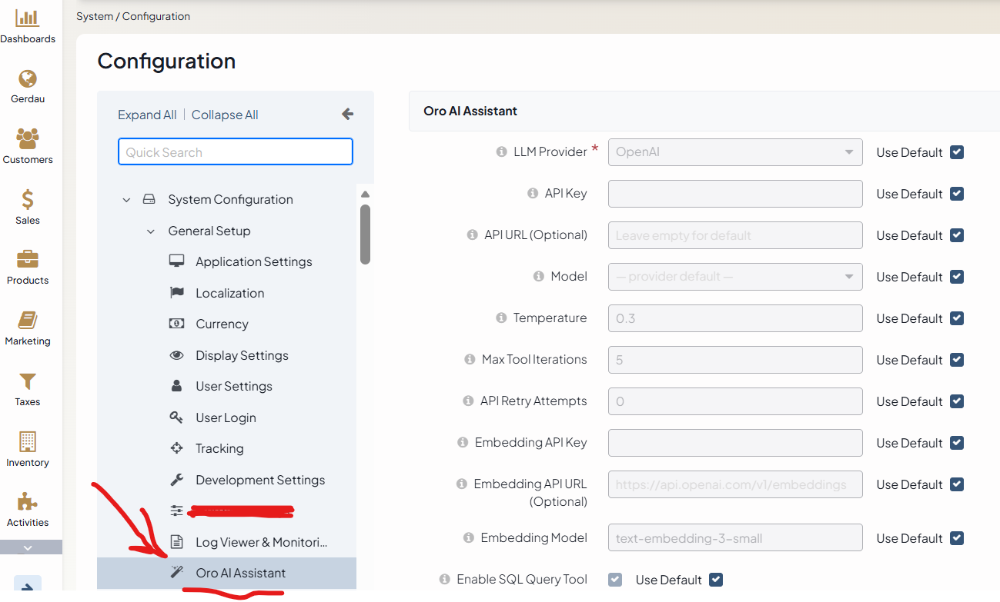

# GenakerOroAIBundle

AI assistant for OroCommerce. Adds a chat input to the admin header **and** an addable
dashboard widget (both share one JS implementation) that connect to a configurable LLM
backend, with tool use (SQL queries, entity lookup, schema inspection, config reading) and a
RAG knowledge base backed by Redis Stack.



---

## Features

- **Multi-provider LLM** — OpenAI, Anthropic Claude, Google Gemini; switch via env var or admin UI
- **Model selection** — dropdown in System Configuration populated from `Resources/config/ai_models.yml`; no code change needed to add new models
- **Tool use** — the agent can query the database, inspect entity metadata, look up routes, read logs, and more
- **Custom instructions** — free-form text prepended ahead of the built-in system prompt on every call, for house style, terminology, or extra guardrails — no code change needed
- **Research sub-agent** — delegates open-ended, multi-step investigations to a separate agent with its own tool loop and step budget, returning one synthesized answer instead of consuming the main conversation's iteration budget; opt-in, disabled by default
- **RAG (Retrieval-Augmented Generation)** — semantic search over docs, DB schema, system config, and admin menu; answers are grounded in real OroCommerce data
- **Chat UI** — always-visible input in the admin header; on send the panel slides open below the header and the input relocates inside the panel for a native chat experience
- **Dashboard widget** — the same chat experience as an addable OroCommerce dashboard widget ("ORO AI Assistant"), sharing one JS file with the header chat (`oroai-chat.js`'s `initOroAiChat({idPrefix, mode})` factory) instead of maintaining two implementations
- **Resolution harness** — optional outer retry loop that evaluates each reply and retries with a different tool/approach when the first attempt is incomplete, instead of returning a shallow answer (see [HARNESS.md](HARNESS.md))
- **Extensible by convention, not by editing this bundle** — any bundle can add its own RAG docs, general agent guidelines, or tools without touching `GenakerOroAIBundle`'s code (see [Extending the agent](#extending-the-agent) below)

---

## Quick start

### 1. Configure the provider

Add to `.env-app.local`:

```dotenv
###> OroAI / Gemini config ###
OROAI_PROVIDER=gemini
OROAI_API_KEY=<your-gemini-key>
OROAI_MODEL=gemini-2.0-flash
OROAI_EMBEDDING_API_KEY=<your-gemini-key>
OROAI_REDIS_URL=redis://redis_search:6379
###< OroAI / Gemini config ###
```

Supported values for `OROAI_PROVIDER`: `gemini`, `openai`, `anthropic`.

### 2. Start the Redis Stack container

RediSearch (vector search) requires the Redis Stack image — the plain `redis` service does not have it:

```bash
docker-compose up -d redis_search
```

### 3. Build the RAG index

```bash
php bin/console genaker:oroai:rag:reindex --provider=docs --provider=config
```

### 4. Verify RAG is working

```bash
php bin/console genaker:oroai:rag:test "application URL" --top=3
```

### 5. Clear Symfony cache

```bash
php bin/console cache:clear
```

---

## Configuration

### Environment variables

Env vars take priority over admin UI settings. Symfony Dotenv sets `$_SERVER`/`$_ENV` only — `getenv()` returns false for vars loaded from `.env-app.local`.

| Variable | Default | Description |
|----------|---------|-------------|
| `OROAI_PROVIDER` | `openai` | LLM provider: `openai`, `gemini`, `anthropic` |
| `OROAI_API_KEY` | — | API key for the LLM provider |
| `OROAI_MODEL` | provider default | Model name — overrides the admin UI dropdown |
| `OROAI_CUSTOM_INSTRUCTIONS` | — (empty) | Text prepended ahead of the built-in system prompt on every call |
| `OROAI_EMBEDDING_API_KEY` | falls back to `OROAI_API_KEY` | Separate key for embedding calls |
| `OROAI_REDIS_URL` | `redis://redis_search:6379` | Redis Stack URL for the RAG vector index |

### Admin UI

Go to **System → Configuration → General Setup → Oro AI Assistant** to set the provider, API key, model, temperature, and toggle individual tools — no deployment needed.

### Custom instructions

Add house style, terminology, or extra guardrails without touching code. Set it via **System → Configuration → General Setup → Oro AI Assistant → Custom Instructions**, or with an env var (which takes priority over the admin UI, same as the other settings):

```dotenv
OROAI_CUSTOM_INSTRUCTIONS="Always refer to customers as \"accounts\". Never suggest deleting records — recommend disabling them instead."
```

It's sent as its own system message, prepended ahead of the bundle's built-in system prompt, so it takes the highest priority on every call — before tool-use guidelines and any RAG-retrieved context. Leave it empty to use only the built-in prompt (the default).

### Research sub-agent

For open-ended questions that need cross-checking several tools or tables — "explain how shipping rates are calculated end to end", not "what is order #42" — the main agent can delegate to a **research sub-agent**: a second, independent tool-calling loop with its own step budget, invoked as an ordinary tool (`research`) and returning one synthesized answer instead of a raw trace. This mirrors how Claude Code's own `Agent` tool keeps a main conversation's context clean by handing open-ended exploration to a sub-agent rather than letting it consume the main loop's iteration budget.

It's **disabled by default** — unlike every other tool, one call spawns a whole extra multi-step LLM loop, so it's opt-in:

| Setting | Where | Default | Description |
|---------|-------|---------|-------------|
| `genaker_oro_ai.tool_research_enabled` | System Configuration → Enabled Tools → **Research Sub-Agent** | `false` | Master switch — when off, the `research` tool isn't even offered to the main agent |
| `genaker_oro_ai.research_max_iterations` | System Configuration → AI Assistant Settings → **Research Sub-Agent Max Steps** | `8` | The sub-agent's own step budget, separate from (and typically higher than) `Max Tool Iterations` |

Two things worth knowing if you're extending this:
- The sub-agent's tool list always **excludes `research` itself**, so it can't recursively delegate to another copy of itself.
- `ResearchSubAgent` builds its internal `ToolRegistry` lazily on first use, not in its constructor — it's built from the same `genaker_oroai.tool` tagged iterator that `ResearchTool` itself is tagged into, so eagerly consuming it during construction would be a circular self-reference (`ResearchTool` → `ResearchSubAgent` → tagged tools → `ResearchTool`...). See `ResearchSubAgent`'s class doc for the full explanation.

### Model list

Available models are defined in [`Resources/config/ai_models.yml`](Resources/config/ai_models.yml). To add a model, append an entry under the appropriate provider group:

```yaml
models:
  gemini:
    - { label: 'Gemini 2.0 Flash (15 RPM free)', value: 'gemini-2.0-flash' }
    - { label: 'Gemini 2.5 Flash (10 RPM free)', value: 'gemini-2.5-flash' }
    - { label: 'Gemini 2.5 Pro', value: 'gemini-2.5-pro' }
  openai:
    - { label: 'GPT-4o', value: 'gpt-4o' }
    ...
```

Run `cache:clear` after editing the file.

---

## Chat UI behaviour

1. **Collapsed** — compact input + send button visible in the header search row
2. **First send** — panel slides open below the header; input relocates inside the panel below the message history
3. **Minimize / Clear / Escape / click-outside** — panel closes; input returns to the header
4. **Focus** — input is auto-focused when the panel opens and again after each AI response so you can keep typing without clicking
5. **Loading state** — while waiting for a reply (and before any tool-use checklist step arrives), a randomly rotating status word drawn from 100 B2B/OroCommerce-themed verbs ("Ordering…", "Quoting…", "Reconciling…", "Palletizing…", ...) cycles every 1.4s in place of a static "Thinking…" label, in the style of Claude Code's own CLI spinner
6. **Tool trace** — each assistant reply shows the tools it called (hover a name for the tool's description); the generic `skill` tool shows which skill was loaded, e.g. `skill: write_sql_report`
7. **Token bar** — a footer row of small colored pills under the messages breaks down where the tokens of the last exchange went (hover any pill for its explanation): estimated prompt ingredients (`prompt ~1.4k`, `guidance ~290`, `skills ~738`, `tools ~1.4k`, `message ~8`) on the left, a divider, then the provider's actual billed usage (`output 14`, `thinking 94`, `in 4.3k`, `cost ≈$0.004`) on the right — built from real DOM nodes (`tokenChip()`), not an HTML string, so a tooltip containing a double quote (e.g. Gemini's `"thoughts"`) can never break the markup
8. **Debug transcript** — every conversation is logged in full (each LLM request/response, tool call/result and the final reply, with flow separators) to `var/cache/{env}/chats/<session_id>.txt`; the session id is shown in the widget header next to the token counter (e.g. `AI Assistant · 5.5k tokens - m1x3k9a7f2b4`) so a misbehaving chat can be matched to its transcript instantly. A new id is issued per conversation (and on Clear).
9. **Recent chats (resume)** — the last 5 conversations per admin user are kept in `cache.app` (Redis when configured, 7-day TTL) and listed at the very bottom of the widget; clicking one restores its full message history and continues the conversation under the same session id — like `claude --resume`. Sessions are strictly per-user; endpoints: `GET /admin/oroai/chat/sessions` (list) and `GET /admin/oroai/chat/session?id=<id>` (messages).
10. **Server-side history** — the widget sends only the new message + its session id; `ChatOrchestrator` loads the conversation so far from `ChatSessionStore` and trims it to a token budget (`ContextWindowManager`, ~6k estimated tokens, newest kept) before it enters the prompt. One source of truth, no oversized payloads, and no way for a client to inject fabricated assistant turns. A `history` field in the payload (older cached widget JS) is ignored.

### Token bar segments

| Segment | Meaning | Source |
|---|---|---|
| `prompt` | Base system prompt — the built-in agent instructions sent with every request | estimate (~4 chars/token) |
| `guidance` | Guidelines merged from all bundles + admin *Additional Guidelines* — always in the prompt | estimate |
| `instructions` | Admin *Custom Instructions* prepended to the prompt | estimate |
| `skills` | Skill catalog — one trigger line per enabled skill (bodies only load when a skill is used) | estimate |
| `tools` | All other tool definitions: names, descriptions, parameter schemas | estimate |
| `history` | Earlier messages of this conversation, re-sent in full with every request | estimate |
| `message` | The current user message | estimate |
| `output` | Tokens the model generated for the visible reply | provider-reported |
| `thinking` | Hidden reasoning tokens spent before answering (Gemini `thoughtsTokenCount`) — billed like output, never shown in the reply | provider-reported |
| `in` | Total input tokens the provider processed **for the whole turn, summed over all agent iterations** — every tool call re-sends the entire conversation plus prior tool results, so `in` is usually several times the one-request estimates on the left | provider-reported |
| `cost` | APPROXIMATE cost of the turn (and the running session total) at public per-1M-token list prices for the configured model, thinking billed as output — see `TokenCostEstimator::PRICES_PER_MILLION`; actual billing may differ | estimate from provider-reported tokens |

The left side describes the ingredients of ONE request (estimated at ~4 characters per token,
computed in `OroAiAgent::buildPromptBreakdown()` and returned as `token_breakdown` by the chat
endpoint); the right side is the provider's authoritative billing count for the full multi-tool
turn. The gap between the two is the token cost of the agent loop itself — the main lever if
usage needs reducing is trimming history and tool results, not the catalog texts.

---

## Dashboard widget

The exact same assistant is also addable as a standard OroCommerce dashboard widget — go to
**Dashboard → Configure → Add Widget → ORO AI Assistant**. It's gated by the same
`genaker_oroai_chat` ACL as the header chat and talks to the same
`/admin/oroai/chat/message` / `/admin/oroai/chat/progress` endpoints, so conversations,
tool-use checklist, and token usage display all behave identically to the header — it's a
different mount point (`mode: 'inline'` vs. the header's `mode: 'panel'`), not a different
implementation.

For the general mechanics of how any Oro dashboard widget is wired — the route-exposure trap,
the `.widget-content` response contract, `WidgetConfigs` wiring for the title bar, seeding a
widget into the default dashboard layout — see
**[DASHBOARD_WIDGET_GUIDE.md](DASHBOARD_WIDGET_GUIDE.md)**, written from the real issues hit
building this specific widget.

---

## Extending the agent

Four things can be added by any bundle in the codebase, purely by convention — no edit to
`GenakerOroAIBundle` itself required:

| To add | Drop this | Picked up by |
|---|---|---|
| A new tool the agent can call | A class implementing `AiToolInterface`, tagged `genaker_oroai.tool` in `services.yml` | `ToolRegistry` — its own `ToolDefinition::description` is also its "when to use me" guidance, rendered into the system prompt automatically |
| A cross-cutting behavioral rule (not about one tool) | A **keyed** entry under `oro_ai.guidelines` in your bundle's own `Resources/config/oro/oro_ai_guidelines.yml` | `GuidelineProvider`, which merges the key across every registered bundle in kernel registration order — a later bundle can **override** a guideline by re-declaring its key, or **remove** it with `the_key: ~` (regular Oro cumulative-config semantics; legacy unkeyed list entries are auto-keyed `<bundle>_<index>`). Admins can do the same without a deployment via System Configuration → Oro AI Assistant → *Additional Guidelines* (or `OROAI_ADDITIONAL_GUIDELINES`), which merges last: a YAML mapping there adds/replaces/removes by key, plain lines are appended |
| Documentation the agent can search (`doc_search`) | A Markdown file in your bundle's own `Resources/rag/` | `DocFilesRagProvider`, then `php bin/console genaker:oroai:rag:reindex --provider=docs` |
| A **skill** — a step-by-step procedure loaded on demand (only its one-line trigger lives in the prompt; the full body costs tokens only when used) | EITHER a Claude-style Markdown file `Resources/ai_skills/<skill_key>.md` with a frontmatter `description:` (the "when to use me" trigger; optional `name:` overrides the filename key) — OR a keyed entry under `oro_ai.skills` in `Resources/config/oro/oro_ai_skills.yml` with `description` + `body`. Same cumulative merge as guidelines: later bundles override by key, `the_key: ~` removes; within a bundle YAML wins over Markdown. Toggle: *Enabled Tools → Skills* | `SkillProvider` + the generic `skill` tool, whose definition doubles as the skill catalog in the system prompt |

### Skills in depth

A skill is a declarative "how to do X" procedure. Unlike a guideline (always in the prompt)
or a RAG doc (found only if the model searches, returned in chunks), a skill costs ONE
catalog line per request — `- key: when to use me` inside the `skill` tool's description —
and its full body is loaded verbatim only when the model invokes `skill(name)`.

Two ways to declare one (both support cumulative override: later bundle wins per key,
`the_key: ~` removes; within a bundle YAML wins over Markdown):

```markdown
<!-- Resources/ai_skills/diagnose_missing_bol.md — Claude-skill style -->
---
description: 'Use when a shipment grid row shows an empty Bill of Lading.'
---
1. Find the line item's delivery_id ...
```

```yaml
# Resources/config/oro/oro_ai_skills.yml — inline style / overrides
oro_ai:
    skills:
        my_skill: { description: 'Use when ...', body: '1. ...' }
        someone_elses_skill: ~   # remove
```

This bundle ships ~28 skills covering reports, entity lookups, diagnostics
(errors, slow pages, missing emails, login issues), operations health (queue, cron,
integrations, failed jobs) and audit/security — see `Resources/ai_skills/`. Keep bodies
SHORT (3–5 steps): the whole 28-skill catalog costs ~650 prompt tokens and each body
~60–100 more when loaded.

Admins can hide individual skills without a deployment: **System Configuration →
Oro AI Assistant → Enabled Tools → Disabled Skills** (a checkbox list built at runtime
from every registered skill — ticked = hidden; new skills default to enabled). The whole
mechanism can be switched off with the *Skills* checkbox above it. Env overrides:
`OROAI_DISABLED_SKILLS=key1,key2`.

Selection is catalog-based, NOT RAG-based — deterministic, works without Redis/embeddings,
and new skills are live instantly. If the skill count ever reaches ~30–50, the always-on
catalog cost (~30 tokens/skill/message) starts to outweigh an on-demand lookup: at that
point move the long tail behind a `find_skill(query)` search tool and keep only the
high-traffic skills inline.

All of these use the same underlying mechanism — Oro's `CumulativeResourceManager`, the same
singleton behind cross-bundle `Resources/config/oro/*.yml` and `Resources/views` loading —
scanning every registered bundle for a file at a known relative path rather than a hardcoded
list. See `GuidelineProvider`/`DocFilesRagProvider` for the reference implementation if adding
a fourth extension point on the same pattern.

---

## Directory structure

```
GenakerOroAIBundle/
├── Agent/              # OroAiAgent — orchestrates tools and RAG context
│                       # ResolutionHarness — optional outer retry/evaluate loop
│                       # GuidelineProvider — merges oro_ai_guidelines.yml across bundles
│                       # ResearchSubAgent — independent loop for delegated deep-dives
│                       # ChatProgressStore — live "what is it doing" checklist backing store
│                       # ContextWindowManager — trims loaded history to a token budget
├── Command/            # ChatCommand — terminal chat client (same ChatOrchestrator as the web widget)
│                       # LiveStatusLine — terminal counterpart of the widget's live tool checklist
│                       # rag:reindex, rag:test
├── Controller/         # ChatController — thin HTTP layer (parse → ChatOrchestrator → JSON)
├── Core/
│   ├── Model/          # Provider-agnostic DTOs: ChatMessage, LlmRequest/Response, ChatOutcome
│   └── Contract/       # AiToolInterface, LlmClientInterface
├── DependencyInjection/
├── Form/Type/          # AiModelChoiceType — builds model dropdown from ai_models.yml
├── Llm/                # LLM clients (OpenAI, Gemini, Anthropic) + registry
├── Rag/                # Embedding clients, RediSearchRagStore, providers
│   ├── Provider/       # DocFiles, Schema, Menu, SystemConfig, CacheMemory providers
│   └── Contract/       # RagProviderInterface
├── Resources/
│   ├── config/
│   │   ├── ai_models.yml           # model list for the admin UI dropdown
│   │   ├── oro/
│   │   │   ├── dashboards.yml      # registers the ORO AI Assistant dashboard widget
│   │   │   └── oro_ai_guidelines.yml  # this bundle's own general-guideline contribution
│   │   └── services.yml
│   ├── ai_skills/      # Claude-skill-style Markdown skills (one file per skill)
│   ├── public/js/      # oroai-chat.js — shared chat UI, initOroAiChat({idPrefix, mode})
│   ├── rag/            # Markdown knowledge-base files indexed by docs provider
│   └── views/
│       ├── Chat/       # chatBar.html.twig — header widget
│       └── Widget/     # aiChat.html.twig — dashboard widget
├── Service/            # OroAiConfig — reads env vars and system config
│                       # ChatOrchestrator — runs one turn: history, agent/harness, transcript, cost, session persistence
│                       # ChatSessionStore — recent-conversation store (Recent chats / resume)
│                       # ChatTranscriptLogger — full debug transcript per session id
│                       # TokenCostEstimator — approximate USD cost from provider-reported usage
│                       # LlmErrorPresenter — humanizes provider/HTTP failures for the widget
├── Tools/              # SQL, schema, entity, route, log, config, translation, research, code, skill tools
├── tests/e2e/          # Playwright suite — see "Running tests" below
├── RAG.md              # RAG technical reference
├── HARNESS.md          # Resolution harness technical reference
├── DASHBOARD_WIDGET_GUIDE.md  # General guide to building any Oro dashboard widget
└── EXAMPLES.md         # Use-case examples
```

---

## Resolution Harness deep-dive

See **[HARNESS.md](HARNESS.md)** for:

- Full loop diagram showing all three evaluator outcomes
- Context enrichment — how "tools already tried" prevents redundant retries
- Memory system — how resolved answers feed back into RAG
- Cost model — LLM call budget per request at various settings
- Configuration reference and when-to-enable guidance
- Full `HarnessInterface` and `HarnessResult` API

---

## RAG deep-dive

See **[RAG.md](RAG.md)** for:

- Embedding models, dimensions, and storage format
- Cosine similarity algorithm and score interpretation table
- How to tune top-K, similarity thresholds, and chunk size
- HNSW index parameters and brute-force fallback
- Switching between Gemini and OpenAI embeddings
- Adding a custom RAG provider
- Full unit test and integration test examples

---

## CLI reference

| Command | Description |
|---------|-------------|
| `genaker:oroai:chat [message]` | Terminal chat client — same agent/harness/tools/RAG as the web widget (see below) |
| `genaker:oroai:rag:reindex` | Rebuild the vector index from all (or selected) providers |
| `genaker:oroai:rag:test <query>` | Search the index and show scores — useful for debugging relevance |

```bash
# Reindex only config and docs
php bin/console genaker:oroai:rag:reindex --provider=config --provider=docs

# List all registered providers
php bin/console genaker:oroai:rag:reindex --list

# Drop index and rebuild from scratch (required after switching embedding model)
php bin/console genaker:oroai:rag:reindex --clear

# Test a query — shows cosine distance, similarity %, and matched text
php bin/console genaker:oroai:rag:test "checkout configuration" --top=5
php bin/console genaker:oroai:rag:test "checkout configuration" -k 1 --full
```

### Terminal chat (`genaker:oroai:chat`)

A second front end onto the exact same `ChatOrchestrator` the web widget's `/admin/oroai/chat/message`
endpoint calls — same agent/harness loop, same tools, same RAG, same token/cost accounting. Not a
reimplementation: ask the same question either way and get the same answer.

```bash
# Interactive REPL
php bin/console genaker:oroai:chat --current-user=admin

# One-shot — ask once, print the reply, exit (script-friendly; non-zero exit on error)
php bin/console genaker:oroai:chat "where are customer users?" --current-user=admin

# Resume a specific conversation (same session id shown in the web widget / debug transcripts)
php bin/console genaker:oroai:chat --current-user=admin --session=m1x3k9a7f2b4
```

`--current-user` is Oro's own global console option (every command gets it, resolved before
`execute()` runs) — pass it to get an ACL-aware security context, which is what lets
`ChatSessionStore` persist the conversation (so it also shows up in the web widget's *Recent
chats*, and vice versa: `--session=<id>` can resume a conversation started in the browser).
Without it the assistant still answers, it just runs anonymously and nothing is saved.

In-REPL commands: `/new` (start a fresh conversation), `/clear` (clear the screen and start a
fresh conversation — the CLI counterpart of the widget's Clear button), `/sessions` (list recent
conversations — same list the widget's Recent chats panel shows), `/resume <id>` (switch to a
different conversation by session id — pairs with `/sessions`), `/id` (print the current session
id), `/help`, `/exit`/`/quit` (Ctrl+D also works). Admin paths in a reply (`/admin/...`, even
backtick-quoted) render as real clickable terminal hyperlinks (OSC 8) resolved against the
**Application URL** system setting — plain text on terminals/output that don't support it. Each
reply shows the same tool trace and token/cost breakdown as the widget's token bar, rendered as
plain text; a live status line (`⠋ running sql_query`, `⠙ attempt 2/10`, …) redraws in place
while a turn is in flight —
the terminal counterpart of the widget's rotating "thinking…" word and tool checklist.

---

## Running tests

```bash
# Unit tests (no containers needed)
bin/phpunit -c phpunit-dev.xml src/Genaker/Bundle/OroAI/Tests/Unit

# Integration tests (requires live redis_search container)
INTEGRATION_TESTS_ENABLED=1 bin/phpunit -c phpunit-dev.xml --filter RagStoreIntegrationTest
```

### End-to-end (Playwright)

A standalone suite in `tests/e2e/` drives a real browser against the running app — login, type,
click send, assert on what actually renders. Two specs:

- `oroai-chat.spec.js` — raw HTTP API: auth, validation, response shape
- `oroai-chat-admin-ui.spec.js` — the real widget: layout, a full reply, a two-turn conversation,
  the token bar's chips/tooltips, and the Recent chats resume flow (send → appears in the list →
  Clear → still listed → click → transcript restored)

Provisions its own `oroai_test_admin` account on demand (`genaker:oroai:test:ensure-admin`), so it
never depends on the real `admin` account's password.

```bash
cd src/Genaker/Bundle/OroAI/tests/e2e
npm install
npx playwright install chromium   # first run only
npm test
```

Requires the app serving at `http://localhost:8000` (override with `ORO_TEST_HTTP_HOST`/`_PORT`)
and a configured LLM provider — tests that need a live reply are skipped, not failed, when no API
key is set. A prompt that fans out into several tool calls (e.g. "what is the current system
status") can legitimately take a minute or more end to end, especially with the Resolution Harness
enabled (each retry attempt reruns the whole tool loop) — that's real LLM/tool latency, not a
hang.

## Rate limits (Gemini free tier)

| Model | RPM | RPD |
|-------|-----|-----|
| `gemini-2.0-flash` | 15 | 1 500 |
| `gemini-2.5-flash` | 10 | 500 |
| `gemini-2.5-pro` | 5 | 25 |

Upgrade to a paid API key or switch to `gemini-2.0-flash` to reduce 429 errors.
